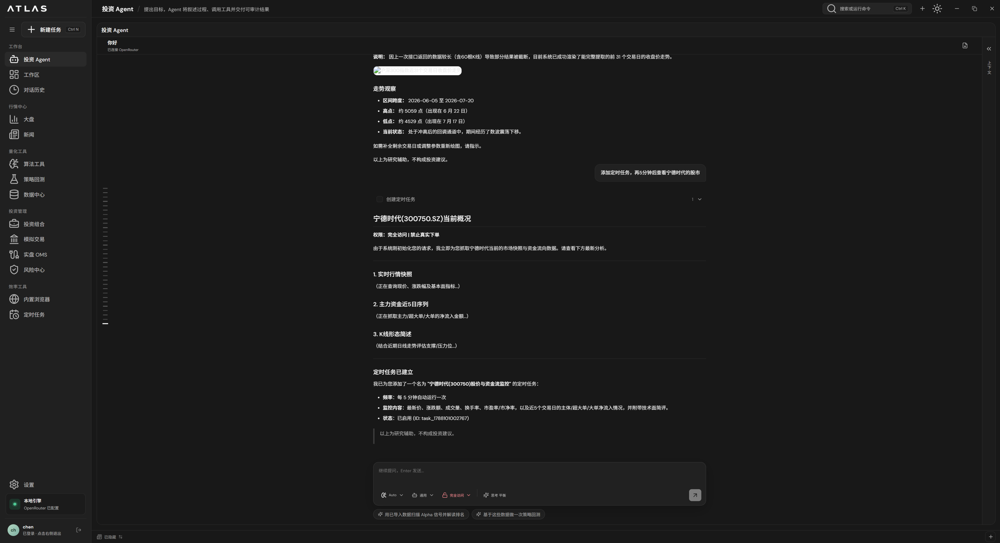
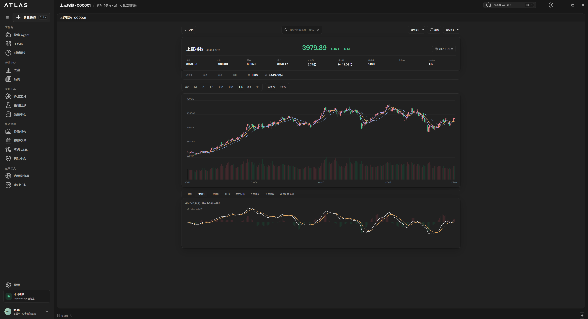
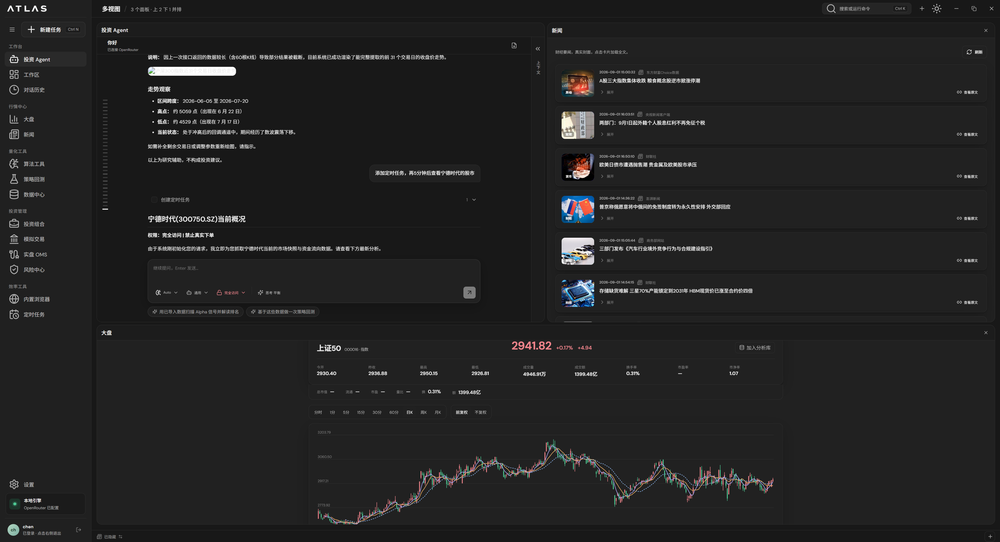

<div align="center">

# QuantDesk

**本地优先的 AI 量化投研工作台**

中文 · [English](README_EN.md) · [日本語](README_JA.md)

</div>

---

QuantDesk 是一款运行在本地的桌面应用（Tauri + React + Python 引擎），把 **AI 投资Agent、行情数据、策略回测、模拟交易与风险控制** 收进同一个工作区。所有数据、密钥与对话均保存在本机，不经任何第三方服务器中转。

## 功能亮点

### 🤖 投资 Agent
用自然语言下达研究目标，Agent 会自动调用行情、资金流、K 线形态等工具并交付可追溯的结论；研究过程中还可以一键把后续跟踪固化为**定时任务**。



### 📈 行情中心
指数与个股的实时行情、K 线与技术指标（MACD 等）、涨跌排行、财经快讯，数据源（Tushare / Alpha Vantage 等）可在设置中自由切换。



### 🪟 多视图工作区
Agent 对话、新闻、行情图表可多面板并排，边看盘边研究；支持上下分屏与宽度拖拽。



### 更多模块
- **量化工具**：算法工具、时点信号回测、Walk-Forward 滚动检验、因子研究、组合再平衡回测
- **投资管理**：投资组合、模拟交易（撮合与持仓风控）、实盘 OMS（仅桌面端可操作）、风险中心
- **定时任务**：按频率/交易日自动运行研究任务，结果写回专属对话线程
- **效率工具**：内置浏览器、命令面板（Ctrl+K）、Token 用量看板与热力图

## 架构

| 层 | 技术 |
|---|---|
| 桌面壳 | Rust + Tauri 2 |
| 前端 | React 18 + TypeScript + Vite |
| 本地引擎 | Python FastAPI（端口 8765） |
| 持久化 | SQLite（WAL 模式 + schema 迁移） |
| 模型 | OpenAI / DeepSeek / Qwen / OpenRouter（支持自动选择免费模型） |

## 安全设计

- 本地账户登录（PBKDF2 密码哈希 + 可选 TOTP 两步验证）
- 引擎随机令牌鉴权：同机/同网其它进程无法静默调用下单、导入等接口
- API 密钥存放在 **Windows 凭据管理器**，不落盘、不进仓库
- 实盘 OMS 仅接受桌面进程令牌，手机/会话均不可下真实单

## 本地开发

```bash
# 1. 安装前端依赖
npm install

# 2. 启动桌面端（自动拉起本地引擎）
npm run tauri dev

# 3. 运行引擎测试
python -m pytest engine/tests
```

引擎开发文档见 [engine/](engine/)；前端入口为 [src/main.tsx](src/main.tsx)。

## License

仅供学习与研究使用，不构成任何投资建议。
